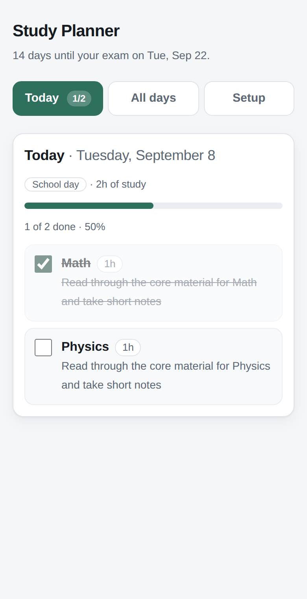
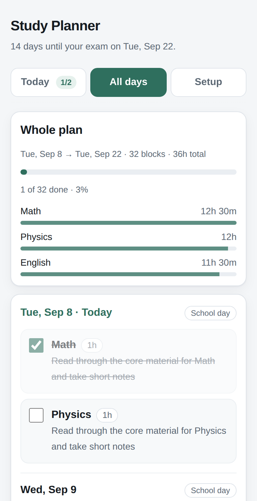

# Study Planner

An installable study planner for students. Enter your subjects, one exam date and how many
hours you can study, and it builds a day-by-day plan from today up to the exam.

A progressive web app: add it to your home screen and it opens full screen like a normal
app and keeps working with no connection. No build step, no framework, no backend, no
accounts, no network calls — everything is saved in the browser's `localStorage` on the
student's own device.

<p align="center">
  
  
</p>

## What it does

**Inputs (Setup tab)**
- Subjects — add as many as you need, up to 12 (typing `Math, Physics, English` adds all three)
- Exam date — one overall date, any time from tomorrow onward
- Hours available on a school day (Mon–Fri) and on a weekend day (Sat & Sun), in half hours
- Busy days — optional weekday checkboxes for days you can't study at all

**The plan**
- Covers every day from today up to the day before the exam; the exam date itself is marked, not scheduled
- Each day is a school day or a weekend day, and gets that day's hours — busy days get none
- Hours become blocks of about an hour each (15-minute grid, never under 30 minutes, at most 4 a day, and never more blocks than you have subjects)
- Subjects rotate continuously across the whole plan, so time lands evenly rather than resetting each day
- Task text follows the calendar: learning and note-taking early on, practice questions in the middle, timed practice near the end, and light revision in the final days

**Views**
- **Today** — only today's blocks, with a progress bar and days-to-exam count
- **All days** — the whole plan grouped by day, plus total hours per subject so you can see the split is fair
- Tick a block on either view to mark it done; ticks are saved immediately

**Reminders**
- Toggle reminders on, and the app asks the browser for notification permission — never on load
- Up to three reminder times a day, saved with everything else in `localStorage`
- At the time you set: *"Time to study! You have 3 tasks left today in Math, Physics and English."*
- Nothing fires on a rest day, or once you have ticked everything off
- *Send a test* shows exactly what a reminder looks like

**Changing things** — edit anything on the Setup tab and press *Generate my plan*. The plan
rebuilds from today with whatever days are left, and blocks already ticked stay ticked.
*Clear all saved data* removes everything from the device.

## Files

> **There is no build step and no dependencies — no npm, no bundler, no `package.json`.**
> If a host asks which framework this is, the answer is *none* / *Other* / *static*.


| File | What it is |
| --- | --- |
| `index.html` | The whole app — markup, styles, planner logic, install prompt |
| `manifest.webmanifest` | Name, icons, colours, standalone display, Today / All days shortcuts |
| `sw.js` | Service worker: caches the app shell for offline, and opens the app when a reminder is tapped |
| `icons/` | 192px and 512px icons, a maskable 512px icon, and a 180px Apple touch icon |
| `_headers` | Cache and security headers for Netlify / Cloudflare Pages |
| `netlify.toml` | Tells Netlify there is nothing to build and to publish the repo root |
| `package.json` | Capacitor dependencies and the build / sync scripts (the web app itself needs none) |
| `capacitor.config.json` | App id, app name, and the `www` directory Capacitor packages |
| `scripts/build-www.mjs` | Copies the app into `www/` for Capacitor — Node built-ins only |
| `android/` | The generated Android project you open in Android Studio |
| `vercel.json` | Same for Vercel: no framework, no build, serve the root, plus the headers |

## Deploying it

The repo *is* the site — there is no build step and no server side, so any static host works.

**GitHub Pages** — Settings → Pages → Build and deployment → Source: *Deploy from a branch*,
branch `main`, folder `/ (root)`. The site appears at
`https://<your-username>.github.io/studyplanner/` within a minute or two.

**Netlify** — *Add new site → Import an existing project*, pick this repo, and accept the
defaults; `netlify.toml` supplies them.

**Cloudflare Pages** — connect the repo, leave the build command empty and set the output
directory to `/`.

**Vercel** — *Add New → Project*, import this repo, and deploy. Leave the framework preset
alone: `vercel.json` pins **Framework Preset: Other** with no real build step, which is what
this repo needs. Do **not** pick the Vite (or any other framework) preset — that makes
Vercel run `npm run build` and look for a `dist/` folder, and there is no `package.json`
here to build, so the deploy fails. If a project was already created with a framework
preset, `vercel.json` overrides it on the next deploy; you can also set it back by hand
under Settings → General → Framework Preset → *Other*.

**Anywhere else** — copy the whole folder to any static host. The page, manifest, service
worker and icons must stay together, and the service worker needs **https** (or
`localhost`) to register.

**No host at all** — double-click `index.html` and it runs straight from `file://`, minus
the service worker (browsers only register those over http/https). Everything else works.

There is no configuration and no API key. To rename it, change the `<title>` and the `<h1>`
in `index.html`, plus `name` / `short_name` in `manifest.webmanifest`.

## Installing it

On **Android or desktop Chrome / Edge**, an *Add to your home screen* bar appears the first
time the browser judges the app installable; *Install* triggers the browser's own prompt,
*Not now* hides it for good. The browser menu's install entry works too.

On **iPhone and iPad**, Safari has no install event, so the same bar shows the manual steps:
**Share → Add to Home Screen**.

Once installed it launches full screen with no browser chrome, and long-pressing the icon
gives shortcuts straight into **Today** or **All days**.

## Android app (Capacitor)

The same `index.html` also ships as a native Android app. Capacitor wraps the web build in
a WebView and gives it real OS-level notifications, so reminders fire with the app closed
— the one thing the web version genuinely cannot do.

```bash
npm install          # once
npm run build        # copies the app into www/
npx cap sync android # copies www/ into the Android project and wires up plugins
npx cap open android # opens it in Android Studio
```

`npm run android` does all three in one go. In Android Studio press **Run** for a device or
emulator; **Build → Build Bundle(s) / APK(s) → Build APK(s)** produces
`android/app/build/outputs/apk/debug/app-debug.apk`, and **Build → Generate Signed
Bundle / APK → Android App Bundle** produces the `.aab` that Google Play wants.

| Where | What to change |
| --- | --- |
| `capacitor.config.json` | App id (`com.mobolajibello.studyplanner`) and display name |
| `android/app/build.gradle` | `versionCode` (an integer, +1 per upload) and `versionName` |
| `android/app/src/main/res/values/strings.xml` | The name under the launcher icon |

On native the app detects the Capacitor bridge and changes behaviour: reminders are handed
to `@capacitor/local-notifications` (scheduled daily by Android, rescheduled whenever the
times change, cancelled when the toggle goes off), the service worker is skipped since the
assets are already local, and the install bar is hidden. `www/` and `node_modules/` are
build artefacts and are not committed.

## How reminders work, and what they cannot do

There is no server here, so there is no push service to wake a sleeping phone. What the
app does instead, entirely in the browser:

- While the app is open — including in a background tab or minimised — a 30-second timer
  fires each reminder time as it arrives.
- A reminder whose time passed while the app was closed fires on the next launch that day,
  as long as it is less than four hours late. Older than that and it is dropped rather than
  arriving at midnight.
- Each time fires at most once a day, recorded per date so a reload cannot repeat it.
- Notifications go through `registration.showNotification()` whenever a service worker is
  running, because Android Chrome refuses the plain `new Notification()` constructor.
  Tapping one focuses an open window or opens the app on Today.

The Reminders tab says this out loud rather than implying the app can nag you unprompted.
On iPhone and iPad notifications work **only** once the app is added to the Home Screen
(iOS 16.4+); in a plain Safari tab the tab explains that instead of offering a dead toggle.
If notifications are blocked, it shows the per-platform steps to re-enable them.

## Offline

The service worker caches the app shell (page, manifest, icons) on first visit, so after
that the app launches with no connection. Plans live in `localStorage`, which never needed
the network, so an offline launch is a full-featured one.

Navigations are served from the cache and refreshed in the background, so a new deploy
appears on the launch after the one that downloaded it. Editing `index.html` alone needs no
version change; bump `CACHE_VERSION` in `sw.js` when you add or rename a precached file,
and the old cache is deleted on activate.

## Notes

- Dates are handled as local `YYYY-MM-DD` strings, so a plan never shifts a day across timezones.
- The page follows the device's light/dark setting and is built for phone screens first.
- The installed app and the same page in the browser share one origin, so they share the
  same saved plan.
- Storage is per-browser: a plan made on a phone won't appear on a laptop, and clearing
  site data clears the plan. If `localStorage` is blocked (private mode), the app still
  works for the session, it just won't remember anything.
- English only, and nothing in it is specific to any country's school system.
